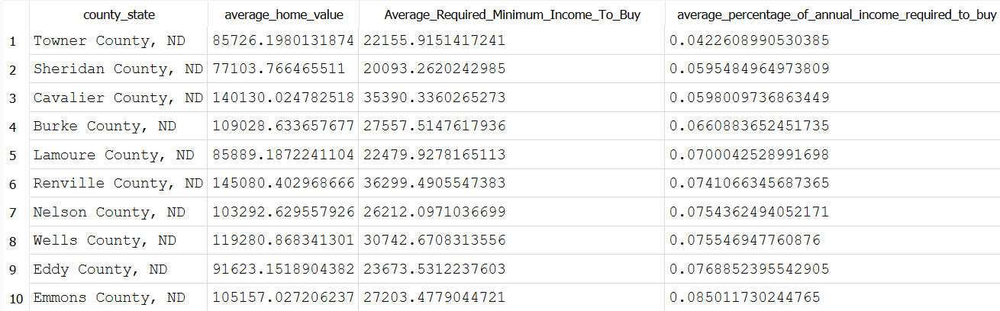
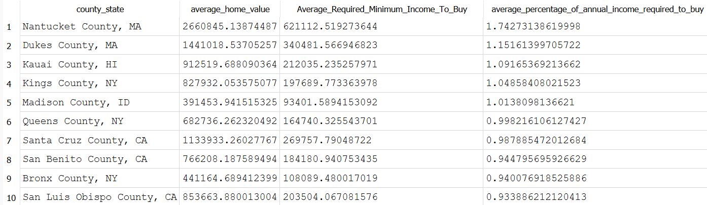
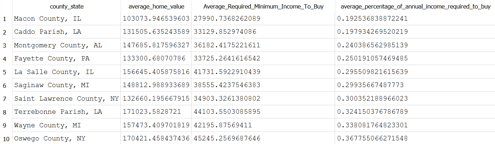
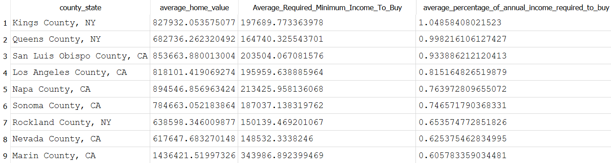

## SQL
The calculation used to find the `Required Minimum Income to Buy` and the `Percentage of Annual Income Required to Buy` can be found by creating calculations using SQL

### 2023 Q3 Top 10

### 2023 Q3 Bottom 10

### 2023 Q3 ATTOM Top 10

### 2023 Q3 ATTOM Bottom 10

